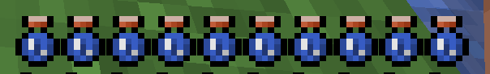

# Thirst

Thirst is a value represented by your thirst bar, it works like exactly hunger, but you have to drink or eat different food items for it to increase.

As your thirst gets lower, you'll start to receive negative effects:

* Half Thirst:
    * Slowness 1
* 1/4 Thirst:
    * Slowness 2
    * Weakness 1
    * Depression 1
* 1 Thirst:
    * Slowness 2
    * Weakness 2
    * Depression 1
* 0 Thirst:
    * Slowness 2
    * Weakness 2
    * Depression 1
    * Weird 1